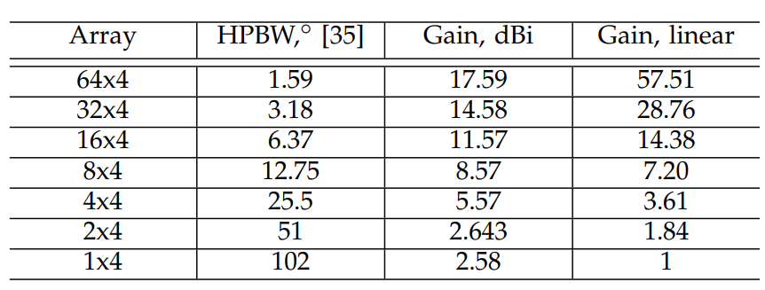

Planar antenna arrays
==================

This code uses the formulas from A. B. Constantine, Antenna Theory: Analysis and Design. Wiley Interscience, 2005 to generate planar antenna gains.

Table with gains and equations are provided in [Chukhno, N., Chukhno, O., Moltchanov, D., Molinaro, A., Gaidamaka, Y., Samouylov, K., ... & Araniti, G. (2021). Optimal Multicasting in Millimeter Wave 5G NR with Multi-beam Directional Antennas. IEEE Transactions on Mobile Computing.](https://trepo.tuni.fi/bitstream/handle/10024/136731/Optimal_Multicasting_in_Millimeter_Wave_5G_NR_Systems_with_Multi_beam_Directional_Antennas.pdf?sequence=1)

